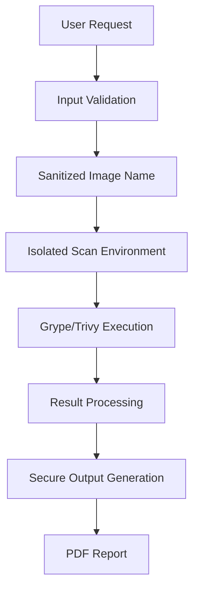

# Security Policy

## Overview

ContainerGuard is a security-focused tool designed to scan container images for vulnerabilities using Grype and Trivy scanners. We take security seriously and have implemented multiple layers of protection to ensure the tool itself remains secure while helping users identify vulnerabilities in their container images.

## Security Features

### 🔒 Container Security
- **Non-root execution**: Containers run as `appuser` (non-root) to minimize privilege escalation risks
- **Minimal base image**: Uses `python:3.12-slim` for reduced attack surface
- **Dependency pinning**: All Python dependencies are pinned to specific secure versions
- **Regular updates**: Base images and dependencies are regularly updated for security patches

### 🛡️ Code Security
- **No dangerous functions**: Code is free from `eval()`, `exec()`, and unsafe deserialization
- **Input sanitization**: All user inputs are properly sanitized and validated
- **Logging over print**: Proper logging implementation for better security monitoring
- **Secret management**: No hardcoded secrets or credentials in the codebase

### 📋 Automated Security Checks
Our Copilot ruleset automatically flags:
- Outdated Docker images and Python versions
- Known vulnerable package versions
- Insecure coding practices
- Hardcoded secrets or credentials
- Root user execution in containers

## Supported Versions

We provide security updates for the following versions:

| Version | Supported          |
| ------- | ------------------ |
| main (latest) | :white_check_mark: |
| Development | :white_check_mark: |

## Reporting a Vulnerability

### 🚨 Security Contact

If you discover a security vulnerability in ContainerGuard, please report it responsibly:

- **GitHub Security Advisories**: Use the "Security" tab in our GitHub repository
- **Alternative**: Create a private issue and tag it as security-related

### 📝 What to Include

When reporting a vulnerability, please include:

1. **Description**: Clear description of the vulnerability
2. **Steps to reproduce**: Detailed steps to reproduce the issue
3. **Impact assessment**: Potential impact and severity
4. **Affected versions**: Which versions are affected
5. **Suggested fix**: If you have ideas for remediation
6. **Your contact information**: For follow-up questions

### ⏱️ Response Timeline

- **Initial response**: Within 48 hours
- **Assessment**: Within 5 business days
- **Fix timeline**: Critical issues within 7 days, others within 30 days
- **Public disclosure**: After fix is released and users have time to update

## Security Best Practices for Users

### 🐳 Container Deployment

```dockerfile
# ✅ Good: Use specific versions
FROM python:3.12-slim

# ❌ Bad: Avoid latest tags
FROM python:latest
```

### 📦 Dependency Management

```txt
# ✅ Good: Pin specific versions
flask>=2.3.0
pillow>=10.0.1

# ❌ Bad: Unpinned dependencies
flask
pillow
```

### 🔐 Running Scans Securely

1. **Network isolation**: Run scans in isolated environments when possible
2. **Minimal permissions**: Use least-privilege principles
3. **Output validation**: Validate scan results before processing
4. **Regular updates**: Keep ContainerGuard updated to latest version

### 🏃‍♂️ Production Deployment

- Use container orchestration security features (pod security policies, etc.)
- Implement proper RBAC (Role-Based Access Control)
- Monitor container behavior and logs
- Regular security scanning of the ContainerGuard image itself

## Security Architecture

### 🔄 Scan Process Security



### 🛠️ Security Controls

| Control Type | Implementation |
|--------------|----------------|
| Input Validation | Regex-based image name sanitization |
| Process Isolation | Non-root container execution |
| Output Sanitization | XML/HTML entity encoding in reports |
| Dependency Security | Automated vulnerability scanning |
| Code Quality | Copilot rules and static analysis |

## Known Security Considerations

### ⚠️ Current Limitations

1. **Docker socket access**: Requires Docker socket mounting for image scanning
2. **Network access**: Needs internet connectivity for vulnerability database updates
3. **File system access**: Requires write access for report generation

### 🔧 Mitigation Strategies

1. **Restricted Docker access**: Use Docker-in-Docker or remote Docker daemon
2. **Network policies**: Implement egress filtering for specific domains only
3. **Volume mounts**: Use read-only mounts where possible

## Compliance and Standards

ContainerGuard follows security best practices from:

- **OWASP Container Security Top 10**
- **NIST Container Security Guidelines**
- **CIS Docker Benchmark**
- **SLSA Supply Chain Security Framework**

## Security Monitoring

### 📊 Recommended Monitoring

- Monitor container resource usage for anomalies
- Track scan frequency and patterns
- Alert on unusual network connections
- Log all API requests and responses

### 🚨 Security Alerts

Watch for:
- Unexpected privilege escalation attempts
- Unusual network traffic patterns
- Failed authentication attempts
- Resource exhaustion attacks

## Incident Response

### 🆘 Security Incident Process

1. **Detection**: Identify potential security incident
2. **Assessment**: Evaluate scope and impact
3. **Containment**: Isolate affected systems
4. **Investigation**: Determine root cause
5. **Recovery**: Restore normal operations
6. **Lessons Learned**: Update security measures

## Security Updates

### 🔄 Update Frequency

- **Critical security fixes**: Released immediately
- **High severity issues**: Within 7 days
- **Medium/Low severity**: Next scheduled release
- **Dependency updates**: Monthly security review

### 📢 Communication Channels

Security updates are communicated via:
- GitHub Security Advisories
- Release notes

## Additional Resources

### 📚 Security Documentation

- [Docker Security Best Practices](https://docs.docker.com/engine/security/)
- [Python Security Guidelines](https://python.org/dev/security/)
- [Container Security Checklist](https://cheatsheetseries.owasp.org/cheatsheets/Docker_Security_Cheat_Sheet.html)

### 🛠️ Security Tools

- **Static Analysis**: Built-in Copilot rules
- **Dependency Scanning**: Automated in CI/CD
- **Container Scanning**: Self-scanning with Grype/Trivy
- **Secret Detection**: Pre-commit hooks recommended

---

## License

This security policy is licensed under the same terms as the ContainerGuard project.

**Last Updated**: June 4, 2025
**Version**: 1.0
